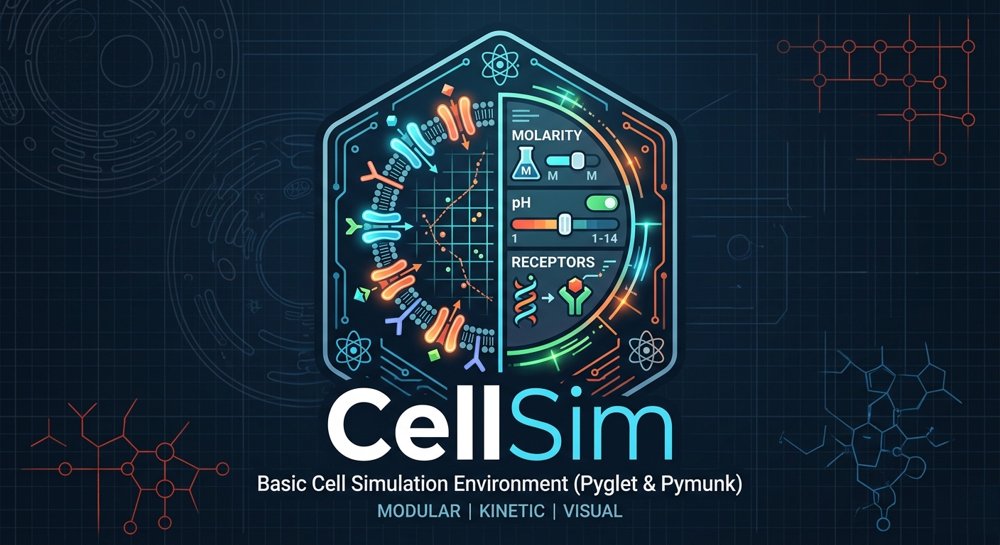
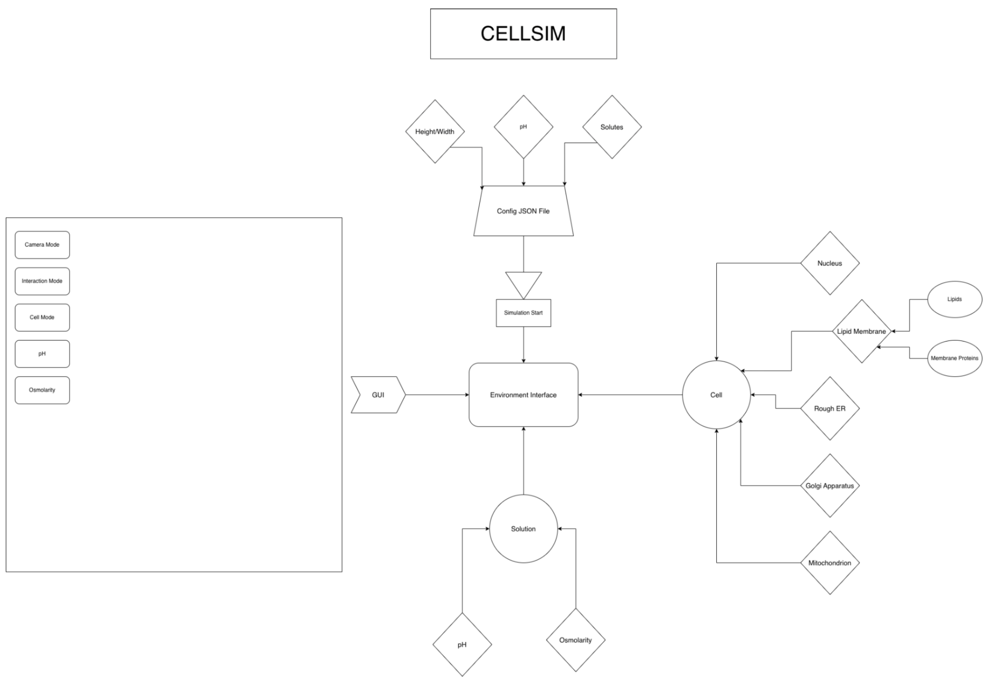

    

# About
CellSim is a simple cell simulator written in Python using pymunk and pyglet. CellSim is an easy-to-use cell simulator
that can help you better understand how cells behave, respond to their environment, and regulate themselves.

# Usage
To use CellSim, run the following on the command line within the py_cell_sim directory:
~~~
python cellsim.py <config_file>
~~~

Where the config file must have the following json format:
~~~json
{
    "height" : int,
    "width" : int,
    "Solution Molarity" : list[float],
    "pH" : float,
    "channels" : list[str],
    "receptors" : list[str],
    "receptor_kds" : dict[str, float]
}
~~~

Each json parameter is defined below:
1. **height**: An integer of the height of the defined in-game window.
2. **width**: An integer of the width of the defined in-game window.
3. **Solution** Molarity: A list of four floats of the form: [Na molarity, Cl molarity, K molarity, Ca molarity]. 
These will become the starting solution molarities.
4. **pH**: A float of the pH of the solution. The cell's pH is assumed to be ~7.0-7.2.
5. **channels**: A list of strings containing valid channels that will appear on the cell membrane. Channels can be one of ["open", "closed"].
6. **receptors**: A list of strings containing valid receptors that will appear on the cell membrane. Receptors can be one of ["A", "B"].
7. **receptor_kds**: A dictionary of strings as keys that are valid receptors and floats as values that are the dissociation constant (Kd) 
of each receptor's ligand.

These parameters create a tunable cellular state and environment that allow the user to customize their experience, learning how modulating different cellular or environmental parameters impacts the cell.

# Architecture

    

The CellSim architecture consists of the following:
1. Config file
2. Cell
3. Solution
4. GUI
